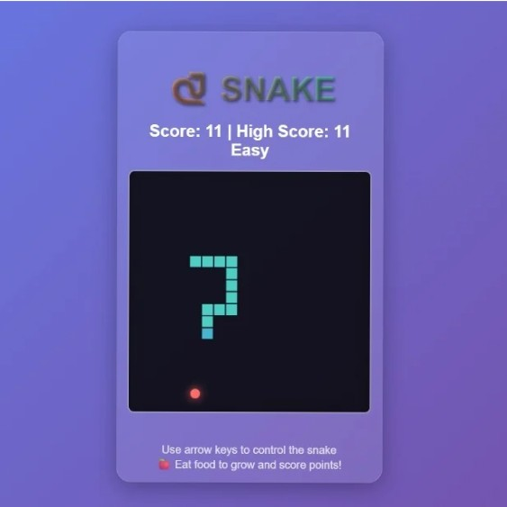

# 🐍 Snake Game

A classic **Snake Game** built with **HTML**, **CSS**, and **JavaScript** — no libraries, no frameworks, just pure front-end fun!



---

## 🎮 How to Play

-   Use **Arrow Keys** to move the snake:
    -   ⬆️ Up
    -   ⬇️ Down
    -   ⬅️ Left
    -   ➡️ Right
-   Eat the red circle (food/apple) to grow.
-   Avoid hitting the walls or your own tail.
-   Game ends when the snake collides with a wall or itself.

---

## 🛠️ Features

-   Pure JavaScript (no libraries)
-   Clean UI using CSS
-   Simple logic for movement, food spawn, and collision

---

## 📂 File Structure

```
.
├── index.html         # Main HTML file
├── style.css          # CSS styles for the game
├── script.js          # JavaScript game logic
├── preview.png        # Screenshot/preview image
└── README.md          # Project documentation
```

---

## 🚀 Run the Game

Just open `index.html` in any modern browser. No setup required!

---

## 💡 Future Ideas

-   Add sound effects 🎵
-   Difficulty scaling ⏱️
